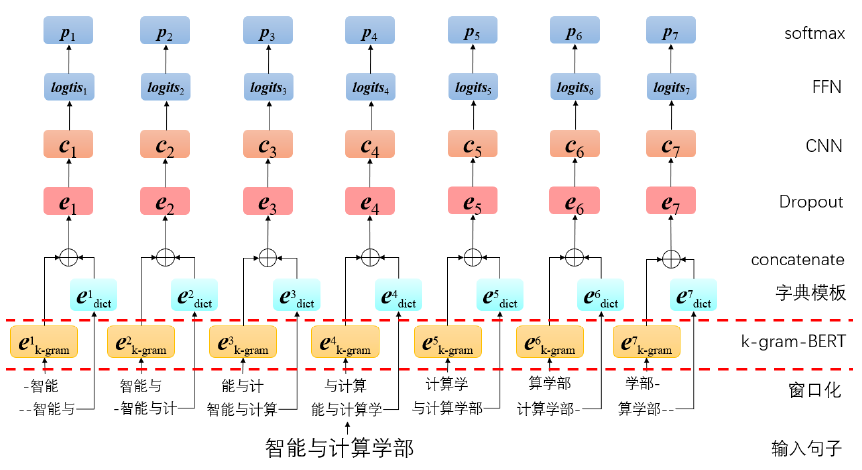

# NNTranSegmentor
Undergraduate graduation project ---- Chinese Word Segmentation for Weibo text  
2020本科毕业设计 ---- 面向微博文本的中文分词

### Installation
This software has been developed on Windows using python 3.6 and pytorch1.3 Since it uses some recent features of pytorch it can be incompatible with older versions.  

The following methods are provided to install dependencies:  
If you use `pip`, we strongly recommend you to create an virtual python3.6 environment by `conda` or `virtualenv`, where NNTranSegmentor is installed after.
- conda
  ```bash
    conda env create -f environment.yml
  ```
- pip
  ```bash
  pip install -r requirements.txt
  ```

### Network Structure


### Usage
- Preprocess  
  Build vocab and insts from corpus, and save them to file`o`. Details see `preprocess.py`.
  ```bash
  python ./preprocess.py -o ./data/pku/pku.vocab.data.bin --train ./data/pku/train.pku.hwc.seg --dev ./data/pku/dev.pku.hwc.seg --test ./data/pku/test.pku.hwc.seg
  ```
  - `o` (str) ------ path of vocab and insts built by `preprocess.py`.
  - `train` (str) ------ path of train text.
  - `dev` (str) ------ path of dev text.
  - `test` (str) ------ path of test text.

- Train  
  ```bash
  python ./train.py
  ```
 
### Author
student: Peiming Guo  
supervisor: [Meishan Zhang](https://zhangmeishan.github.io/)
